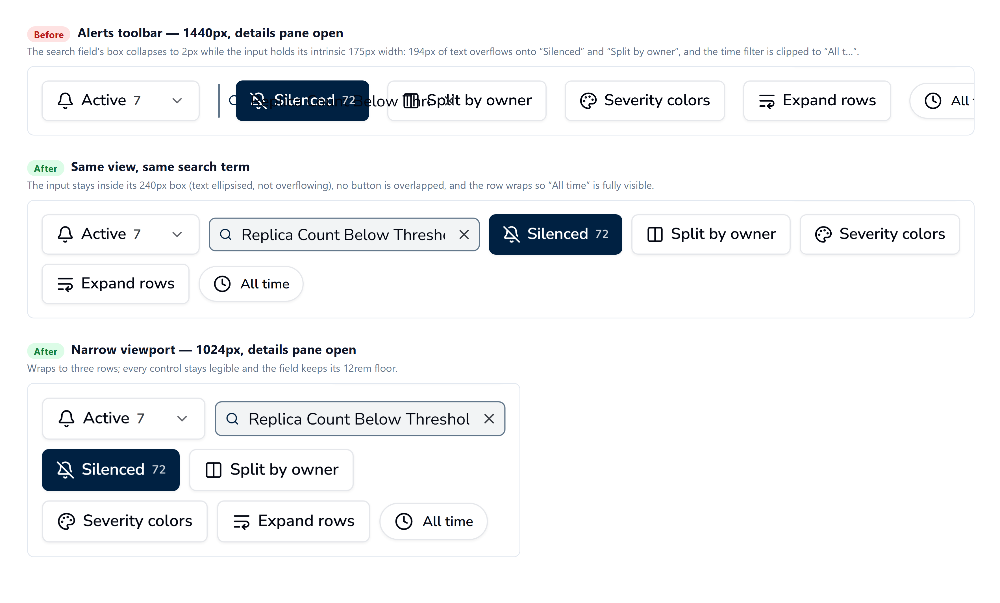

## Issue Reference

Closes #920

---

## What Was Changed

Two files, both in the alerts toolbar:

**`apps/client/src/components/Alerts/AlertsTable/SearchBar/SearchBar.tsx`** — keeps the search field's contents inside the field:

- `min-w-0` on the `<input>`, so it can actually shrink with its container
- `min-w-0` + `overflow-hidden` on the bordered wrapper, so nothing inside it (input text, clear button, AI toggle) can paint outside the field
- `min-w-0` on the component root

**`apps/client/src/components/Alerts/Alerts.tsx`** — gives the toolbar somewhere to go when it runs out of room:

- The toolbar row is now `flex-wrap` (with `gap-2` instead of `gap-4`), so controls drop to a second line instead of being clipped
- The search wrapper keeps a `min-w-[192px]` floor instead of `min-w-0`, so the field stays usable rather than collapsing

---

## Why Was It Changed

The `<input>` is a flex child, so it carries the default `min-width: auto` — its automatic minimum size, which for a text field is its intrinsic ~20-character width. Its wrapper, meanwhile, was `flex-1 min-w-0` and free to collapse to nothing.

Every other control in that row is `shrink-0`, so when space runs short the row squeezes the only thing it can: the search wrapper. Measured on the playground at 1440px with the details pane open, the wrapper collapsed to **2px** while the input held its **175px** intrinsic width — **194px of text overflowing**, rendered straight over the "Silenced" and "Split by owner" buttons. That is the garbled toolbar in the issue.

Worth flagging for reviewers: the issue guessed at absolute positioning or a z-index problem. That turned out not to be the cause — nothing in the search field is absolutely positioned and no stacking context is involved. It is purely flexbox minimum-size overflow, which is why the fix is `min-w-0` rather than a `z-index` or `background` change.

The wrapping half addresses the same cramped row from the other side: at 1440px with the details pane open the toolbar's controls simply do not fit on one line, which also pushed the time filter out of view (the clipped "All t…" visible in the before shot).

---

## Screenshots

Captured from the playground (`/alerts?playground`) with the same search term in all three, driven through the Chrome DevTools Protocol so the measurements below come from the live DOM rather than from eyeballing the image.

---

## Additional Context (Optional)

- **Measured result.** Overflow of the input past its box, and any toolbar buttons it lands on:

    | View | Before | After |
    | --- | --- | --- |
    | 1440px, details pane open | +194px over `Silenced`, `Split by owner` | −23px, none |
    | 1024px, details pane open | — | −23px, none |
    | 1440px, no details pane | — | −23px, none |

- **Verification.** `tsc --noEmit` clean; `eslint` reports 0 errors on both files (21 warnings, all pre-existing `react-hooks` complaints about `setState` in effects that predate this change); Prettier clean; full client suite passes — `vitest run`, 39 files, 325 tests.
- **Second consumer.** `SearchBar` is also rendered by the `AlertsTable` toolbar, whose wrapper is a bare `flex-1`. The `min-w-0` changes protect that usage from the same overflow with no change at the call site.
- **`gap-4` → `gap-2`.** Deliberate: the tighter gap buys back horizontal room and keeps the two rows from looking disconnected once the toolbar wraps.
- **`min-w-[192px]`** rather than `12rem` — same value, but every other arbitrary width in the client is expressed in px (`min-w-[350px]`, `min-w-[150px]`, …).
- **The AI-mode hint** (`absolute -bottom-4`) sits on the component root, outside the new `overflow-hidden` wrapper, so it is unaffected.
