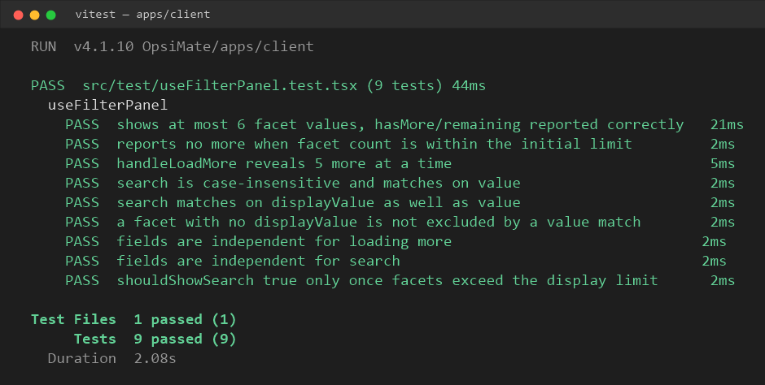

## Issue Reference

Closes #926

---

## What Was Changed

Added `apps/client/src/test/useFilterPanel.test.tsx` with unit tests for the `useFilterPanel` hook, covering:

- Initial display limit of 6 facet values per field, with `hasMore`/`remaining` computed correctly (including when facet count is below the limit)
- `handleLoadMore` revealing 5 more values at a time, up to full reveal
- Per-field search being case-insensitive and matching on both `value` and `displayValue`
- Fields being independent — loading more or searching in one field doesn't affect another
- `shouldShowSearch` only returning true once facets exceed the initial display limit

---

## Why Was It Changed

`useFilterPanel` drives the filter sidebar's "show more" and search behavior but had no test coverage, making regressions in pagination or search matching easy to miss.

---

## Screenshots

---

## Additional Context (Optional)

- `remaining` is not clamped to zero in the hook's current implementation — when the facet count is below the display limit it can go negative (e.g. `4 - 6 = -2`). Tests assert this actual behavior rather than assuming clamping, and inline comments call this out so reviewers don't mistake it for a typo. Fixing the clamping behavior itself was out of scope for this issue.
- Verified with `npx vitest run` — full client suite (39 files, 325 tests) passes.
