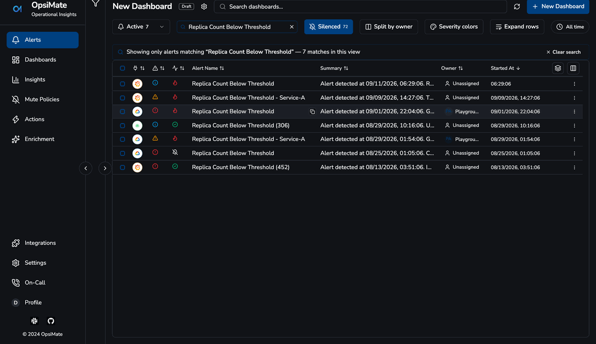
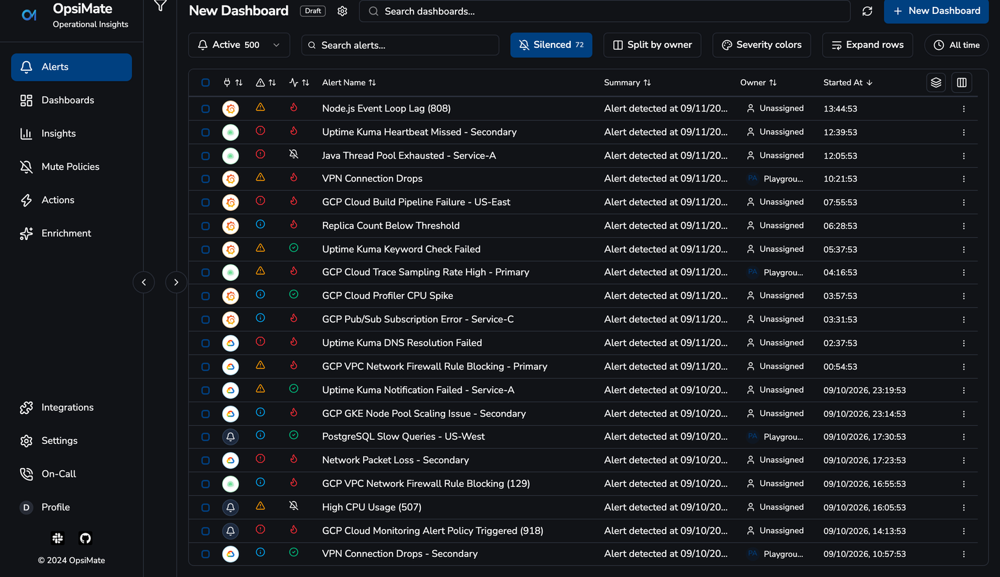
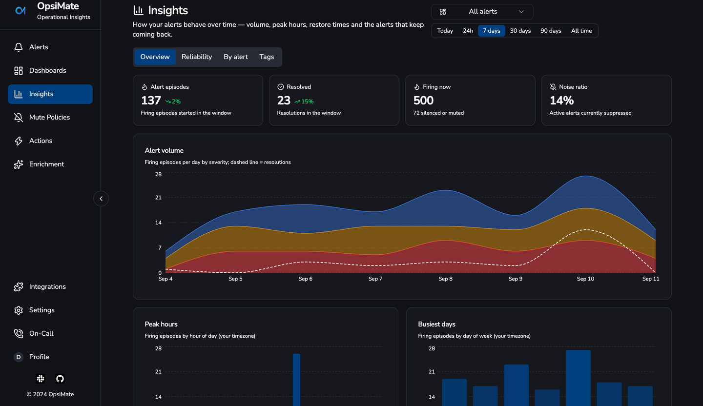

<p align="center">
  
</p>

<h1 align="center">OpsiMate</h1>
<p align="center"><b>One alert queue for all your monitoring tools.</b></p>
<p align="center">
  Grafana, Datadog, Zabbix, Uptime Kuma and Google Cloud each have their own alert list.
  OpsiMate gives your NOC one screen: every alert, one owner, one place to say
  "we know, it's handled" — self-hosted, one container, no SaaS.
</p>

<p align="center">
  <a href="https://img.shields.io/github/commit-activity/m/OpsiMate/OpsiMate">
    
  </a>
  <a href="https://github.com/OpsiMate/OpsiMate/releases">
    
  </a>
  <a href="https://github.com/OpsiMate/OpsiMate/blob/main/LICENSE">
    
  </a>
  <a href="https://github.com/OpsiMate/OpsiMate/stargazers">
    
  </a>
  <a href="https://join.slack.com/t/opsimate/shared_invite/zt-39bq3x6et-NrVCZzH7xuBGIXmOjJM7gA">
    
  </a>

</p>

<p align="center">
  <a href="https://docs.opsimate.dev/docs/getting-started/deploy">Get Started</a> ·
  <a href="https://docs.opsimate.dev/">Docs</a> ·
  <a href="https://demo.opsimate.dev/">Demo</a> ·
  <a href="https://www.opsimate.dev/">Website</a> ·
  <a href="https://github.com/OpsiMate/OpsiMate/issues/new?labels=bug&template=bug_report.md">Report Bug</a>
</p>

---

<p align="center">
  <a href="https://demo.opsimate.dev/">
    
  </a>
  <br/>
  <sub>👆 An alert with its root cause attached, rated by the on-call engineer. Click for the live demo — no signup.</sub>
</p>

### What you get

- 🚨 **One queue** — alerts from every source, deduplicated by ID, with owner, status and comments on each
- 🔎 **Filter, search, group** — by severity, source, tag, team, time window; save the view as a dashboard
- 🔕 **Mute policies** — scheduled or ad-hoc silences that match on any alert field, without deleting anything
- 🏷️ **Enrichment rules** — add tags, links and runbooks to alerts as they arrive, by pattern
- 🧠 **Root cause analysis** — your system pushes a root cause per alert via the API; operators rate it 👍/👎 and the verdict is relayed back to the sender
- 📈 **Insights** — MTTR, MTTA, volume and re-fire trends, per tag, with hourly resolution on short windows
- ☎️ **On-call teams** and role-based access (admin / editor / viewer)

</br>

<table>
<tr>
  <td width="50%"><br/><sub><b>One queue</b> — every source, one table, one owner per alert</sub></td>
  <td width="50%"><br/><sub><b>Insights</b> — volume, MTTR/MTTA and re-fire trends</sub></td>
</tr>
</table>

</br>

## Key Features

### 🚨 Alert sources

Every integration is a webhook — point your tool at OpsiMate and alerts appear in the queue:

<table>
<tr>
    <td align="center" width="140">
        <br/>
        <strong>Grafana</strong>
    </td>
    <td align="center" width="140">
        <br/>
        <strong>Datadog</strong>
    </td>
    <td align="center" width="140">
        <br/>
        <strong>Zabbix</strong>
    </td>
    <td align="center" width="140">
        <br/>
        <strong>Uptime Kuma</strong>
    </td>
    <td align="center" width="140">
        <br/>
        <strong>Google Cloud</strong>
    </td>
    <td align="center" width="140">
        <br/>
        <strong>Anything else</strong><br/>
        <sub>generic webhook</sub>
    </td>
</tr>
</table>

Each source has a setup guide in the app (Integrations → Add) with the exact webhook URL to paste.

## Run it

### Docker — one command, nothing to clone

```bash
curl -fsSL https://raw.githubusercontent.com/OpsiMate/OpsiMate/main/scripts/start-docker.sh | sh
```

Then open **http://localhost:8080** — the first account you register becomes the admin.

### Kubernetes

A Helm chart lives in [`infrastructure/helm`](infrastructure/helm); Terraform for the surrounding infra is in [`infrastructure/terraform`](infrastructure/terraform). See the [deployment docs](https://docs.opsimate.dev/docs/getting-started/deploy).

### Persist your data

| Mount | What lives there |
|---|---|
| `/app/data/database` | the SQLite database — **mount this or you lose everything on restart** |
| `/app/config/config.yml` | your configuration (below) |

### Configuration

```yaml
server:
  port: 3001
  host: "0.0.0.0"

database:
  path: "/app/data/database/opsimate.db"

security:
  private_keys_path: "/app/data/private-keys"
  # Machine-to-machine token: your monitoring tools send it as X-API-Token
  # when pushing alerts and root causes. Change it.
  api_token: "change-me"
```

Set `ENCRYPTION_KEY` (credentials at rest — the server warns at startup if it's missing) and `JWT_SECRET` (session signing) in the environment for anything beyond a laptop.

## Contributing

New here? Start with a [`good first issue`](https://github.com/OpsiMate/OpsiMate/issues?q=is%3Aissue+is%3Aopen+label%3A%22good+first+issue%22) — each one names the exact file and line, and a maintainer reviews within a day or two.

```bash
pnpm install
pnpm dev            # client on :8080, server on :3001
pnpm run check      # lint + prettier — run this before you push; CI runs the same
pnpm test
```

Bigger areas where help is welcome: new alert sources, the incident-management work, and the AI investigation agent (see roadmap).

## Roadmap

**Recently shipped**
- 📈 Alert Insights — MTTR / MTTA / volume trends, hourly on short windows
- 🧠 Root cause analysis via API, with operator ratings fed back to the sender
- 🤖 AI-powered alert search
- ⚡ Server-side query engine — the queue stays fast at 10K+ alerts

**Next**
- 🤖 **Built-in investigation agent** — one-click root cause that actually looks at your cluster, logs and metrics ([HolmesGPT](https://holmesgpt.dev) integration, in design)
- 🔄 **Incidents** — group related alerts into a named incident with a timeline and postmortem
- 📣 **Alert routing** — escalation to Slack / on-call by severity and team

## Support

- **[Documentation](https://docs.opsimate.dev/)** - Comprehensive guides and API reference
- **[GitHub Issues](https://github.com/opsimate/opsimate/issues)** - Bug reports and feature requests
- **[Slack Community](https://join.slack.com/t/opsimate/shared_invite/zt-39bq3x6et-NrVCZzH7xuBGIXmOjJM7gA)** - Join our discussions and get help
- **[Website](https://www.opsimate.dev/)** - Learn more about OpsiMate

---

<div align="center">
  <p>Built with ❤️ by the OpsiMate team · <a href="LICENSE">AGPL-3.0</a></p>
</div>

## 💖 Our Amazing Contributors

This project wouldn’t be what it is today without the incredible people who have shared their time, knowledge, and creativity.  
A huge thank you to everyone who has helped and continues to help make OpsiMate better every day! 🙌

 <a href="https://github.com/OpsiMate/OpsiMate/graphs/contributors">
  
</a>

---
