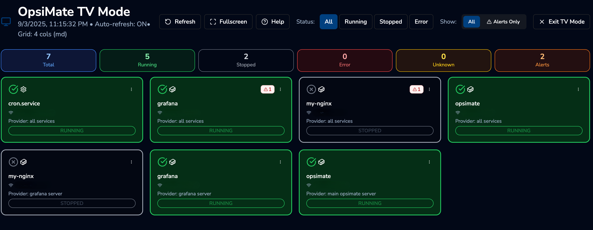

# TV Mode

TV Mode is a full-screen, distraction-free display interface designed for monitoring your infrastructure on wall-mounted displays, dashboards, or dedicated monitoring screens. It provides a clean, high-contrast view optimized for viewing from a distance.

## Overview

### What is TV Mode?

TV Mode transforms OpsiMate into a dedicated monitoring dashboard perfect for:

- **NOC/Operations Centers** - Display real-time service health on wall screens
- **Team Dashboards** - Keep everyone informed about infrastructure status
- **Conference Rooms** - Show system status during meetings
- **Remote Monitoring** - Set up dedicated monitoring displays
- **24/7 Operations** - Maintain constant visibility into service health

### Key Benefits

- **Optimized Visibility** - High-contrast cards with large, readable text
- **Auto-Refresh** - Automatically updates to show latest service status
- **Smart Grid Layout** - Automatically adjusts card size and columns based on the number of services
- **Customizable Views** - Filter by service status, provider, tags, and more
- **Real-time Alerts** - Displays active alerts prominently on affected services
- **Keyboard Shortcuts** - Quick navigation without touching the mouse
- **View Rotation** - Automatically cycle through different service states

---

## How to Enable TV Mode

### Method 1: Using the Dashboard

1. Navigate to your OpsiMate dashboard
2. Click on the **TV Mode** icon or button in the navigation bar
3. Configure your preferred settings (optional)
4. TV Mode will launch automatically

### Method 2: Direct URL Access

Access TV Mode directly through the URL:

```url
http://your-opsimate-instance:8080/tv-mode
```

### Method 3: With Custom Configuration

TV Mode supports URL parameters for customization. Access it with parameters:

```url
http://your-opsimate-instance:8080/tv-mode?autoRefresh=true&refreshInterval=30000&gridColumns=6
```

---

## Configuration Options

TV Mode can be customized using URL parameters:

### Available Parameters

| Parameter | Type | Default | Description |
|-----------|------|---------|-------------|
| `autoRefresh` | boolean | `true` | Enable automatic data refresh |
| `refreshInterval` | number (ms) | `30000` | Time between auto-refreshes (30 seconds) |
| `viewRotation` | boolean | `false` | Automatically cycle through different status views |
| `rotationInterval` | number (ms) | `120000` | Time between view rotations (2 minutes) |
| `defaultView` | string | `all` | Initial view: `all`, `running`, `stopped`, `error` |
| `gridColumns` | number | Auto | Number of grid columns (overridden by smart grid) |
| `searchTerm` | string | `""` | Pre-filter services by search term |
| `filters` | JSON | `{}` | Apply saved filters from dashboard |

### Configuration Examples

#### Example 1: Basic TV Mode with Fast Refresh
```url
/tv-mode?autoRefresh=true&refreshInterval=15000
```
Refreshes every 15 seconds

#### Example 2: Auto-Rotating View for Large Screens
```url
/tv-mode?viewRotation=true&rotationInterval=60000
```
Rotates through different service states every minute

#### Example 3: Only Show Running Services
```url
/tv-mode?defaultView=running
```
Start with only running services visible

#### Example 4: Filtered View with Tags
```url
/tv-mode?filters={"tags":["production","critical"]}
```
Display only services tagged with "production" and "critical"

#### Example 5: Complete Custom Configuration
```url
/tv-mode?autoRefresh=true&refreshInterval=20000&viewRotation=true&rotationInterval=90000&defaultView=all
```

---

## Features

### 1. Auto-Refresh

TV Mode automatically refreshes service data to show real-time status:

- **Default**: Updates every 30 seconds
- **Configurable**: Adjust refresh interval via URL parameters
- **Visual Indicator**: Shows refresh animation in the header
- **Manual Refresh**: Press `Ctrl+R` or click the refresh button

### 2. Smart Grid Layout

The grid automatically adapts to the number of services being displayed:

| Service Count | Columns | Card Size | Best For |
|--------------|---------|-----------|----------|
| 1-6 services | 3 | Large | Detailed view |
| 7-12 services | 4 | Medium | Balanced view |
| 13-24 services | 6 | Small | Compact view |
| 25-48 services | 8 | Small | Dense view |
| 49+ services | 10 | Extra Small | Maximum density |

This ensures optimal visibility regardless of how many services you're monitoring.

### 3. Service Status Indicators

Each service card displays:

- **Status Icon**: Visual indicator (✓ Running, ✕ Stopped, ⚠ Error, ? Unknown)
- **Status Color**: Border and background color coding
  - Green: Running
  - Gray: Stopped
  - Red: Error
  - Yellow: Unknown
- **Service Type**: Docker, Systemd, or Manual
- **Provider Information**: Where the service is running
- **Active Alerts**: Count and list of active alerts

### 4. Real-time Statistics

The header displays key metrics:

- Total services count
- Running services
- Stopped services
- Error states
- Active alerts count
- Current filter status

### 5. Filtering and Search

**Multi-State Selection:**
- Toggle between All, Running, Stopped, Error, and Unknown states
- Combine multiple states (e.g., show both Running and Stopped)
- Filter by alerts (show only services with active alerts)

**Search:**
- Search by service name
- Search by provider name
- Search by IP address
- Search by container image

**Advanced Filters:**
- Filter by service status
- Filter by service type (Docker, Systemd, Manual)
- Filter by provider name
- Filter by provider type
- Filter by container namespace
- Filter by tags

### 6. View Rotation

Automatically cycle through different views perfect for monitoring:

**Rotation Sequence:**
1. All services
2. Running services only
3. Stopped services only
4. Error services only
5. Running + Stopped services
6. Error + Stopped services

Enable with: `?viewRotation=true&rotationInterval=120000`

### 7. Service Actions

Perform actions directly from TV Mode (requires appropriate permissions):

**Available Actions:**
- **Start Service** - Start a stopped service
- **Stop Service** - Stop a running service
- **Restart Service** - Restart a service
- **View Logs** - Access service logs (navigates to service detail)

Access actions via the three-dot menu on each service card.

### 8. Keyboard Shortcuts

Navigate TV Mode without touching the mouse:

| Shortcut | Action |
|----------|--------|
| `Esc` | Exit TV Mode and return to dashboard |
| `1` | Show all services |
| `2` | Toggle running services |
| `3` | Toggle stopped services |
| `4` | Toggle error services |
| `A` | Toggle alert filter |
| `Ctrl+R` | Manual refresh |
| `F11` | Toggle fullscreen |
| `/` | Focus search input |

### 9. Fullscreen Mode

Press `F11` or click the fullscreen button to maximize screen real estate. TV Mode automatically exits fullscreen when you return to the dashboard.

### 10. Network Status

A network indicator shows the connection status, alerting you to any connectivity issues.

---

## Use Cases

### Use Case 1: NOC Operations Center

**Scenario:** Display critical production services on a wall screen

**Configuration:**
```url
/tv-mode?filters={"tags":["production"]}&autoRefresh=true&refreshInterval=20000
```

**Benefits:**
- Real-time monitoring of production services
- Immediate visibility of issues
- Auto-refresh ensures current data

### Use Case 2: Team Dashboard

**Scenario:** Show team's service status in the office

**Configuration:**
```url
/tv-mode?filters={"providerName":["team-cluster"]}&viewRotation=true
```

**Benefits:**
- Everyone sees the same view
- Rotating views show different aspects
- Promotes shared awareness

### Use Case 3: Error Monitoring

**Scenario:** Dedicated screen for monitoring errors

**Configuration:**
```url
/tv-mode?defaultView=error&autoRefresh=true&refreshInterval=10000
```

**Benefits:**
- Immediate error visibility
- Fast refresh for quick response
- Focused on problems only

### Use Case 4: Multi-Environment Overview

**Scenario:** Rotate through different environments

**Configuration:**
```url
/tv-mode?viewRotation=true&rotationInterval=60000&autoRefresh=true
```

**Benefits:**
- See all environments periodically
- Automatic cycling saves manual switching
- Comprehensive overview

---

## Example Screenshots

### Default TV Mode View



*TV Mode displaying all services with the smart grid layout*

### Filtered View (Running Services Only)

When filtering to show only running services, the grid automatically adjusts:

- Status filters active in the header
- Green-themed cards for all running services
- Statistics reflect filtered view
- Grid optimizes for displayed service count

### Alert Monitoring View

When filtering to show only services with alerts:

- Red badges showing alert counts
- Detailed alert information in each card
- Quick access to alert details
- Action buttons for service management

---

## Best Practices

### 1. Optimize for Your Screen Size

**For Large Displays (TV/Monitor):**
- Use fullscreen mode (`F11`)
- Let smart grid handle the layout
- Consider higher refresh rates for critical services

**For Smaller Displays:**
- Use filters to limit displayed services
- Focus on specific teams or environments
- Use search to narrow down services

### 2. Set Appropriate Refresh Intervals

**High-Priority/Production Systems:**
```url
?refreshInterval=10000
```
(10 seconds)

**Standard Monitoring:**
```url
?refreshInterval=30000
```
(30 seconds - default)

**Low-Priority Systems:**
```url
?refreshInterval=60000
```
(60 seconds)

**Note:** Lower intervals increase server load. Balance freshness with performance.

### 3. Use Filters Effectively

**Production Services:**
```url
?filters={"tags":["production"]}
```

**Specific Provider:**
```url
?filters={"providerName":["aws-prod-cluster"]}
```

**Docker Services Only:**
```url
?filters={"serviceType":["DOCKER"]}
```

**Kubernetes Namespace:**
```url
?filters={"containerNamespace":["default"]}
```

### 4. Leverage View Rotation

Ideal for comprehensive monitoring without manual intervention:

```url
?viewRotation=true&rotationInterval=90000
```

Cycles through all service states every 90 seconds, ensuring nothing is missed.

### 5. Combine Features

Create powerful monitoring setups by combining parameters:

```url
/tv-mode?autoRefresh=true&refreshInterval=20000&viewRotation=true&rotationInterval=120000&filters={"tags":["production"]}
```

This configuration:
- Auto-refreshes every 20 seconds
- Rotates views every 2 minutes
- Only shows production-tagged services
- Provides comprehensive, automated monitoring

---

## Troubleshooting

### Issue: Services Not Updating

**Solutions:**
- Check that `autoRefresh=true` is set
- Verify network connectivity (check network indicator)
- Try manual refresh with `Ctrl+R`
- Check browser console for errors

### Issue: Grid Layout Looks Wrong

**Solutions:**
- Remove any custom `gridColumns` parameter to use smart grid
- Refresh the page
- Check screen resolution and zoom level
- Try fullscreen mode (`F11`)

### Issue: Too Many/Few Services Displayed

**Solutions:**
- Review your filter configuration
- Check the search term in the URL
- Verify tag and provider filters
- Use the dashboard to adjust filters, then access TV Mode

### Issue: Filters Not Working

**Solutions:**
- Ensure filters are properly JSON-encoded in the URL
- Verify filter syntax: `?filters={"tags":["tag1","tag2"]}`
- Check that the filter values match actual service properties
- Clear filters and reapply one at a time

### Issue: Performance Problems

**Solutions:**
- Increase `refreshInterval` to reduce server load
- Use filters to display fewer services
- Disable `viewRotation` if not needed
- Check network connection quality
- Consider upgrading server resources if monitoring many services

---

## Technical Details

### URL Parameter Encoding

When using filters in URLs, ensure proper JSON encoding:

**Correct:**
```url
?filters={"tags":["production"]}
```

**URL-Encoded:**
```url
?filters=%7B%22tags%22%3A%5B%22production%22%5D%7D
```

Most browsers handle this automatically, but be aware when constructing URLs programmatically.

### State Persistence

TV Mode reads initial state from URL parameters but does not persist changes. To save a configuration:

1. Configure filters in the main dashboard
2. Access TV Mode (filters will be applied)
3. Bookmark the resulting URL for quick access

### Browser Compatibility

TV Mode works best with modern browsers:

- ✅ Chrome/Edge (recommended)
- ✅ Firefox
- ✅ Safari
- ⚠️ Older browsers may have limited fullscreen support

---

## Integration with Dashboard

TV Mode maintains a connection with your dashboard settings:

### Shared Settings
- **Filters:** Applied from dashboard carry over to TV Mode
- **Search Term:** Active searches are maintained
- **Column Visibility:** Determines what information is shown

### TV Mode Specific
- **Auto-Refresh:** Only active in TV Mode
- **View Rotation:** TV Mode exclusive feature
- **Smart Grid:** Optimized for TV display

### Returning to Dashboard

Press `Esc` or click the exit button to return to the main dashboard. Your dashboard settings will be preserved as you left them.

---

## Security Considerations

### Authentication

TV Mode requires authentication to access. Ensure:

- Users are properly authenticated before accessing TV Mode
- Sessions remain valid during long TV Mode sessions
- Refresh tokens are configured if using long display periods

### Permissions

Service actions (start/stop/restart) in TV Mode respect user permissions:

- Only authorized users can perform actions
- Read-only users can view but not control services
- Admin users have full control

### Network Security

When displaying TV Mode on public screens:

- Consider which information is visible to viewers
- Use appropriate network isolation
- Filter sensitive services from public displays
- Consider disabling service actions for display-only setups

---

## Future Enhancements

Planned improvements for TV Mode:

- **Custom Themes:** Choose color schemes optimized for different lighting conditions
- **Multi-View Split Screen:** Display multiple filtered views simultaneously
- **Historical Trends:** Show service uptime graphs on cards
- **Alert Priorities:** Visual differentiation of alert severity
- **Sound Notifications:** Optional audio alerts for critical status changes
- **Customizable Cards:** Choose which information to display on each card
- **Export Configuration:** Save and share TV Mode configurations easily

---

## Getting Help

If you need assistance with TV Mode:

- **Documentation:** [https://opsimate.vercel.app/](https://opsimate.vercel.app/)
- **GitHub Issues:** [Report bugs or request features](https://github.com/OpsiMate/OpsiMate/issues)
- **Slack Community:** [Join our discussions](https://join.slack.com/t/opsimate/shared_invite/zt-39bq3x6et-NrVCZzH7xuBGIXmOjJM7gA)

---

## Summary

TV Mode transforms OpsiMate into a powerful, full-screen monitoring solution perfect for operations centers, team dashboards, and dedicated monitoring displays. With features like auto-refresh, smart grid layout, view rotation, and comprehensive filtering, it provides the flexibility and visibility needed for effective infrastructure monitoring.

**Quick Start:**
1. Navigate to `/tv-mode`
2. Press `F11` for fullscreen
3. Use number keys to filter by status
4. Let it auto-refresh and monitor your services

**Pro Tip:** Bookmark your customized TV Mode URL with all your preferred parameters for instant access to your perfect monitoring view!
